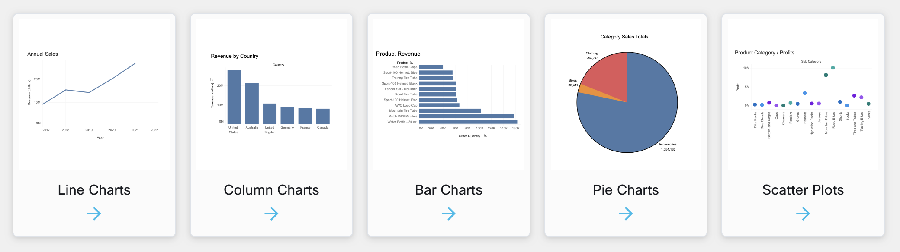

## Types of data

**Data can be categorized into three types:** 

* **Data volunteered** : provided willingly by individuals. ( forms, posting photos and videos on social media or consenting to website policies) 
* **Data observed:** collected through direct measurement such as your location, stores you frequent and websites you visit.
* **Data inferred** derived from analysis and reasoning based on existing data. e.g Your personal style, likes and dislikes and behavioral habits. 

Inferred data is collected about the user without their express input, usually systematically generated based on search histories, purchases, and social media activity. Inferred data is based on well-informed assumptions 

### Data Usage in Daily Life

* Identify trends 
* Make decisions
* Predict future conditions.

### Ways to Visualize Data

### Data Types

* String
* Integer
* Boolean
* Date
* Floating Point

**Structured Data**

Structured data makes up about 10%-20% of generated data and has clearly defined data types and patterns that make them easily stored and organized into columns and rows. This organization makes structured data easy to search and analyze. Sources of structured data include sales records, airline reservation systems, and inventory control. Structured data is usually stored in relational databases such as Structured Query Language (SQL) databases or in spreadsheets such as Microsoft Excel.

**Unstructured Data**

Unstructured data makes up most data that is generated, about 80%, and cannot be organized into row and columns. This makes unstructured data difficult to search, manage, and analyze. Sources of unstructured data include images, PDFs, sensor data, and social media posts. Unstructured data is usually stored in a non-relational database also known as NoSQL Database.  