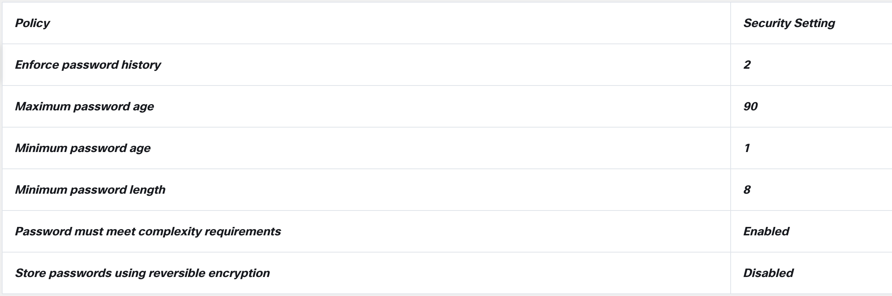
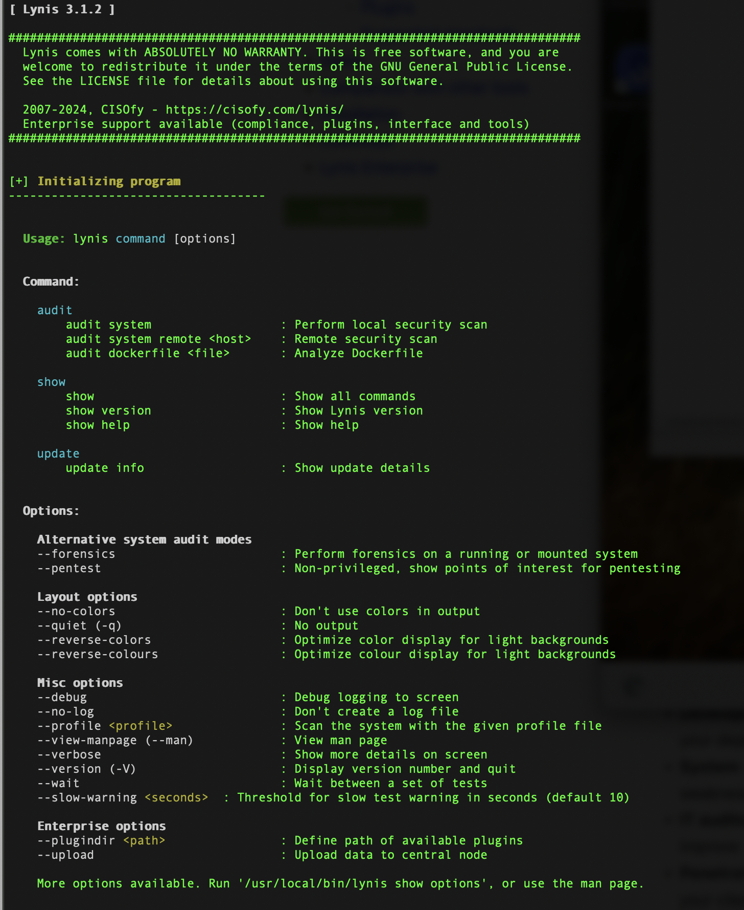
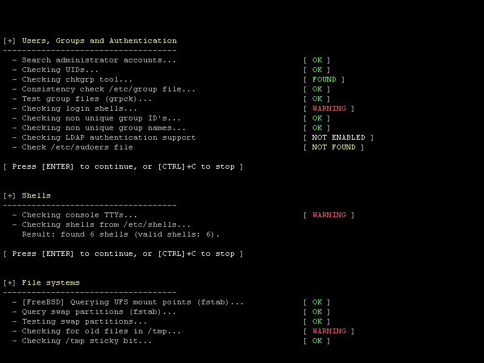

### Lab - Configure Security Features in Windows and Linux

**Objectives**

Part 1: Update Windows and Linux 
Part 2: Windows Local Security Policy 
Part 3: Configure Firewall Rules 
Part 4: Install and Run Applications 

Materials 

* Virtual Machine Linux
* Virtual MAchine Windows 10

**Background / Scenario**

In this lab, I updated both Windows and Linux systems. I configured local security policy and configured firewall rules in Windows. In Linux, I installed two applications: chkrootkit and lynis.

**Part 1: Update Windows and Linux**

New flaws and vulnerabilities are discovered all the time. It is a good idea to keep your PC up to date to mitigate the exploitation of the known vulnerabilities.

**Check for Windows updates**

In the Windows Update window, you can review optional updates and the update history. 

**Linux update and upgrade**

1) **sudo apt-get update** to resynchronize the package index files from their sources.

2) **sudo apt-get upgrade** to retrieve and upgrade the currently installed packages with new versions available.

###Part 2: Windows Local Security Policy 

**Note:** Local Security Policy comes only with Windows Pro or Enterprise editions. 

'How to Enable Local Security Policy (secpol.msc).'  the [Major Geeks Tutorial](majorgeeks.com) website has an excellent tutorial.

**Configurartion Local Password Policy in Windows**

My security policy for password is as follows:

* A user must use a unique password for at least 2 changes of the password.
* Passwords must be at least 8 characters.
* Passwords must be changed every 90 days.
* Can only change the password once a day.
* A password must consist of the following four elements:
	* At least one lower case alpha character.
	* At least one upper case alpha character.
	* At least one numerical character.
	* At least one symbol character.

**Note:** The Store passwords using reversible encryption security setting should always be disabled. Storing passwords using reversible encryption is essentially the same as storing plaintext versions of the passwords. For this reason, this policy should never be enabled unless application requirements outweigh the need to protect password information.

###Step 3: Configure the Account Lockout Policy security settings.

**Account Policies** and click **Account Lockout Policy.**

Change the default settings to the following:

- A user must wait 10 minutes for the lookout counter to reset.

- Users are locked out of the computer after 5 attempts to enter the correct password.

###Part 4: Install and Run Applications Linux

The tool **chkrootkit** is used to check for signs of a rootkit on a local system. Rootkit is a type of malware that can remain hidden on your computer and can be used to cause significant damage to your device by hackers.

`cisco@labvm:~$ sudo apt install chkrootkit`

run a rootkit check

`sudo chkrootkit`

###Step 2: Installing Lynis

lynis is security tool for systems running Unix-based OS, such as Linux and macOS. lynis will be used later in another activity to harden a Linux system. The application Lynis is maintained by [CISOfy](majorgeeks.com). In this step, we will add the software repository and install Lynis.

