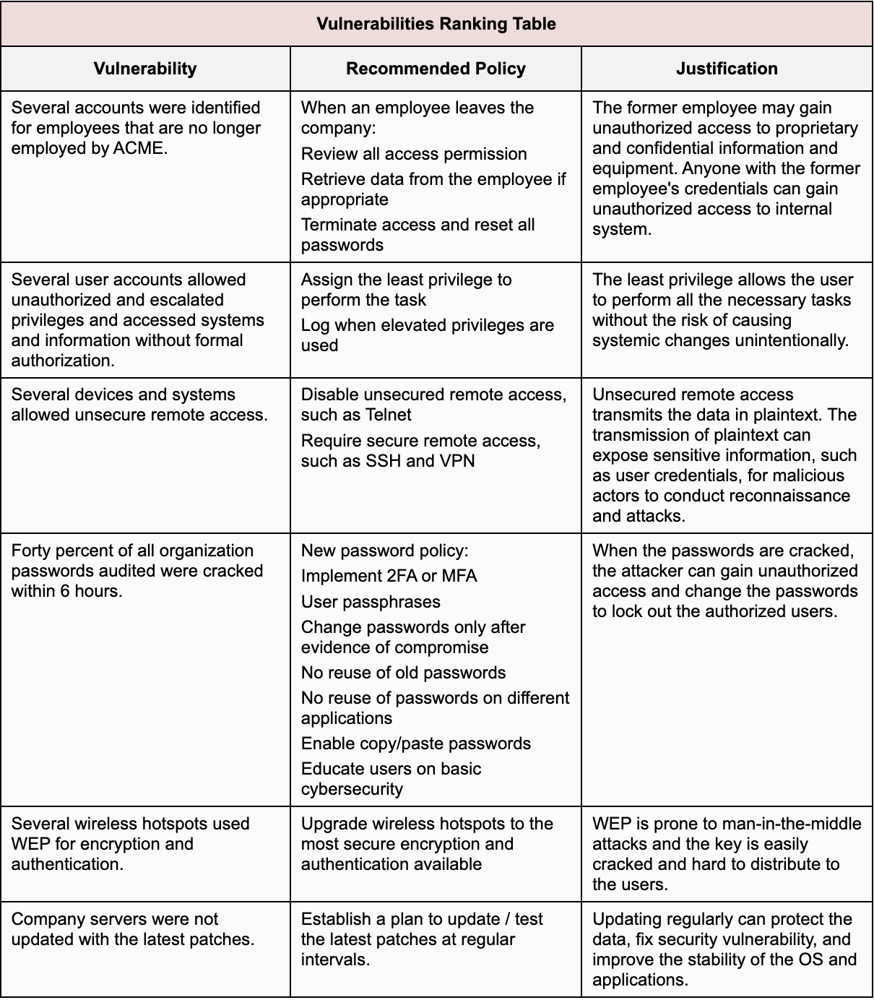

## Lab - Develop Cybersecurity Policies and Procedures

**Introduction**

Information security policies provide a framework for organizations to manage and protect their assets, and a safeguard that the organizations employ to reduce risk. Students will be required to compare information security policies to determine the differences between policies, standards, guidelines, and procedures. Students will then develop an information security policy to address existing vulnerabilities identified by an internal audit.

For example, a password policy states the standard for creating strong passwords and protecting passwords. A password construction guideline defines how to create a strong password and provides best practices recommendations. The password procedure provides the instructions on how to implement the strong password requirement. Organizations do not update policies as frequently as they update procedures within the information security policy framework.

**Objectives**

This project includes the following objectives:

Part 1: Review the Scenario

Part 2: Review and Prioritize Audit Findings

Part 3: Develop Policy Documents

Part 4: Develop a Plan to Disseminate and Evaluate Policies

**SUPPORT MATERIAL**

* [SANS Security Policy Project]
(https://www.sans.org/security-resources/policies/)

* [Information Security Policy (video)]
(https://youtu.be/ZlKgMUOpMf8)

* [Top Computer Security Vulnerabilities]
(https://www.n-able.com/features/computer-security-vulnerabilities)

* [Information Security Policy – A Development Guide for Large and Small Companies (pdf)] (https://www.sans.org/reading-room/whitepapers/policyissues/information-security-policy-development-guide-large-small-companies-1331)

* [Technical Writing for IT Security Policies in Five Easy Steps]
(https://www.sans.org/reading-room/whitepapers/policyissues/technical-writing-security-policies-easy-steps-492)

## Scenario

ACME Healthcare is a healthcare company that runs over 25 medical facilities including patient care, diagnostics, outpatient care, and emergency care. The organization has experienced several data breaches over the last five years. These data breaches have cost the organization financially and damaged its reputation.

The executive leadership team recently hired a new chief information security officer (CISO). The new CISO has brought in one of the top cybersecurity penetration teams to perform a full security audit on the entire organization. This independent contractor conducted the audit, and found the following vulnerabilities:

1)    Several accounts were identified for employees that are no longer employed by ACME.

2)    Several user accounts allowed unauthorized and escalated privileges. These accounts accessed systems and information without formal authorization.

3)    Several devices and systems allowed unsecure remote access.

4)    Forty percent of all organization passwords audited were cracked within 6 hours.

5)    Password expiration was not standardized.

6)    Sensitive files were found unencrypted on user devices.

7)    Several wireless hotspots used WEP for encryption and authentication.

8)    Evidence indicates that sensitive e-mail was sent to and from employee homes and mobile devices without encryption.

9)    Intrusion detection logs were infrequently reviewed and analyzed.

10)  Devices with sensitive company data were used by employees for private use.

11)  Employee devices were left unattended and employees failed to logout of the company network and data systems.

12)  Inconsistent device updates and configurations were performed.

13)  Several firewall rules were set to permit all traffic unless specifically denied.

14)  Company servers were not updated with the latest patches.

15)  The intranet web server allowed users to change personal information about themselves, including contact information.

## Part 2: Review and Prioritize Audit Findings

a.Research the types of vulnerabilities listed to determine which of them pose the greatest threat. Go to Top Computer Security Vulnerabilities to learn more.

b.Based on your research, list the top five security audit findings that ACME should address, starting with the greatest vulnerability.

c.Record your rankings in a Vulnerabilities Ranking Table, like the one shown below. It lists the Vulnerabilities, the Recommended Policy to mitigate this vulnerability, and your Justification for the ranking you determined.

## Part 3: Develop Policy Documents

**Step 1:** **Create an Information Security Policy**

a.     Choose one vulnerability in the table for which to develop a security policy.

b.     Use the [Information Security Policy Templates](https://www.sans.org/information-security-policy/) to develop a specific security policy for ACME Healthcare that addresses your chosen vulnerability.

**Note:** Follow the template as a guideline. Address all existing policy elements. No policy should exceed two pages in length.

**Step 2: Create a Procedure**

a.     Create a step-by-step set of instructions that supports your information security policy. Go to [Information Security Policy — A Development Guide](https://www.sans.org/reading-room/whitepapers/policyissues/information-security-policy-development-guide-large-small-companies-1331) and [Technical Writing for IT Security Policies](https://www.sans.org/reading-room/whitepapers/policyissues/technical-writing-security-policies-easy-steps-492) in Five Easy Steps for instructions and guidance.

**Note:** All the above links will also be useful in Part 4 of this lab. Keep them open and bookmark them.

b.     Include all the information that a user would need to properly configure or complete the task in accordance with the security policy.

Part 4: Develop a Plan to Disseminate and Evaluate Policies
Step 1: Create an Information Security Policy Implementation and Dissemination Plan.
a.     Document the information required to create an information security policy implementation and dissemination plan.

b.     Include specific tasks and events that ACME Healthcare will use to make sure that all employees involved are aware of the information security policies that pertain to them.

c.     Include any specific departments that need to be involved. ACME Healthcare must also be able to assess whether individuals have the proper knowledge of the policies that pertain to their job responsibilities.

**Conclusion**

Information security policies provide a framework for how an organization protects its assets and is a safeguard that the organization employs to reduce risk. This project examined why an organization develops information security policies, and the differences between information security policies, standards, guidelines, and procedures. This project also explored how an organization disseminates and evaluates information security policies.

