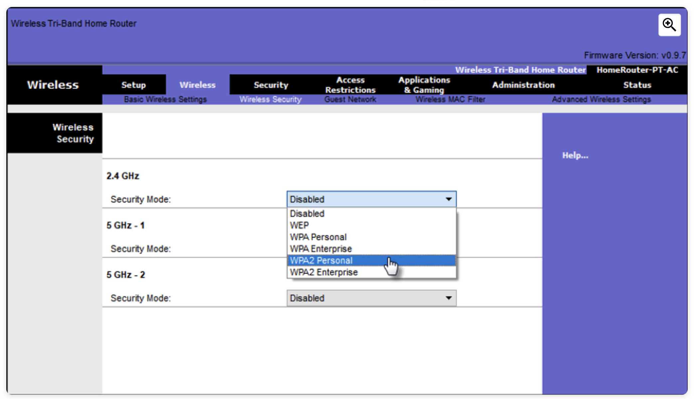

## Securing WLANs

**SSID Cloaking and MAC Address Filtering**

To address the threats of keeping wireless intruders out and protecting data, two early security features were used and are still available on most routers and APs: SSID cloaking and MAC address filtering.

**SSID Cloaking**

APs and some wireless routers allow the SSID beacon frame to be disabled, as shown in the figure. Wireless clients must manually configure the SSID to connect to the network

**MAC Addresses Filtering**

An administrator can manually permit or deny clients wireless access based on their physical MAC hardware address. In the figure, the router is configured to permit two MAC addresses. Devices with different MAC addresses will not be able to join the 2.4GHz WLAN.

**NOTE:** Although these two features would deter most users, the reality is that neither SSID cloaking nor MAC address filtering would deter a crafty intruder. 

## The best way to secure a wireless network is to use authentication and encryption systems.

Two types of authentication were introduced with the original 802.11 standard:

**Open system authentication**: The wireless client is responsible for providing security such as using a virtual private network (VPN) to connect securely. 

**Shared key authentication**: Provides mechanisms, such as **WEP, WPA, WPA2, and WPA3 to authenticate and encrypt data between a wireless client and AP**. However, the password must be pre-shared between both parties to connect.

The following chart summarizes these authentication methods.

**Authenticating a Home User**

**Personal** - Intended for home or small office networks, users authenticate using a pre-shared key (PSK). Wireless clients authenticate with the wireless router using a pre-shared password. No special authentication server is required.

**Enterprise** - Intended for enterprise networks but requires a **Remote Authentication Dial-In User Service (RADIUS) authentication server.** Although more complicated to set up, it provides additional security. 

The device must be authenticated by the RADIUS server and then users must authenticate using 802.1X standard, which uses the Extensible Authentication Protocol (EAP) for authentication.

**Encryption Methods**

**Temporal Key Integrity Protocol (TKIP)** - TKIP is the encryption method used by WPA.

**Advanced Encryption Standard (AES)** - AES is the encryption method used by WPA2. It is the preferred method because it is a far stronger method of encryption.

### Authentication in the Enterprise

In networks that have stricter security requirements, an additional authentication or login is required to grant wireless clients such access. The Enterprise security mode choice requires an Authentication, Authorization, and Accounting (AAA) RADIUS server.

**RADIUS Server IP address** - This is the reachable address of the RADIUS server.

**UDP port numbers** - Officially assigned UDP ports 1812 for RADIUS Authentication, and 1813 for RADIUS Accounting, but can also operate using UDP ports 1645 and 1646, as shown in the figure.

**Shared key** - Used to authenticate the AP with the RADIUS server.

In the figure, the administrator is configuring the wireless router with WPA2 Enterprise authentication using AES encryption. The RADIUS server IPv4 address is configured as well with a strong password to be used between the wireless router and the RADIUS server.

The shared key is not a parameter that must be configured on a wireless client. It is only required on the AP to authenticate with the RADIUS server. User authentication and authorization is handled by the 802.1X standard, which provides a centralized, server-based authentication of end users.

The 802.1X login process uses EAP to communicate with the AP and RADIUS server. **EAP is a framework for authenticating network access.** It can provide a secure authentication mechanism and negotiate a secure private key which can then be used for a wireless encryption session using TKIP or AES encryption.****

## WPA3

WPA2 is no longer considered secure. WPA3, if available, is the recommended 802.11 authentication method. WPA3 includes four features:

* WPA3-Personal
* WPA3-Enterprise
* Open Networks
* Internet of Things (IoT) Onboarding